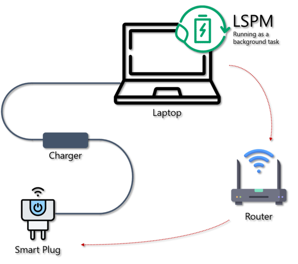

# LSPM - Laptop Smart Power Manager

The **Laptop Smart Power Manager** is a lightweight tool 
designed to autonomously manage laptop battery 
charge cycles with the help of a Smart Plug.

## Description

TODO



## Table of Contents

- [Installation](#installation)
- [Configuration](#configuration)
- [Usage](#usage)
- [Supported devices](#supported-devices)
- [Contributing](#contributing)
- [License](#license)

## Installation

`lspm` can be installed using the package manager 
[pip](https://pip.pypa.io/en/stable/).

```bash
pip install lspm
```

## Configuration

### Prerequisites

Before using **LSPM**, your Smart Plug must be plugged in, 
configured and connected to the same local network as 
your laptop.

To work properly, **LSPM** needs some information 
about the Smart Plug:

- IP Address
- Username
- Password

### Command Line Interface

The easiest way is to use the command line tool `lspm`.

For the first use, enter the configuration parameters 
of your Smart Plug using the command `lspm config`:

```bash
$> lspm config
Enter the Smart Plug IP Address:
Enter a new username: 
Enter a new password: 
```

To get the available options for this command, 
run `lspm config --help`.

## Usage

### Command Line Interface

The easiest way is to use the command line tool `lspm`.

To start **LSPM**, run the command `lspm start`:

```bash
$> lspm start
Laptop Smart Power Manager started correctly
To stop it, press CTRL + C (on macOS, Command + .)
```

To stop it, press `CTRL + C` (or `Command + .` 
on _macOS_). Then, the following message 
should show up:

```bash
Laptop Smart Power Manager stopped successfully
```

## Supported devices

### TP-Link

- **Tapo**
  - P100
  - P105 (not tested)
  - P110 (not tested)

## Contributing

Contributions, issues and feature requests are 
always welcome!

## License

Copyright © 2023 [Imanol Setoain](https://github.com/ImaSet).<br />
This project is [MIT](https://choosealicense.com/licenses/mit/) licensed.